<h1> PNG_Japanese_RoadSigns_90classes</h1>

This is a set of 90classes of PNG Japanese RoadSigns.
 
The dataset has been taken from the following websites: 
<a href="https://en.wikipedia.org/wiki/Road_signs_in_Japan">en.wikipedia.org:Road signs in Japan</a>
 
<a href="https://commons.wikimedia.org/wiki/Road_signs_in_Japan">commons.wikimedia.org: Road signs in Japan</a>
 

 
<a href="./PNG_RoadSigns_90classes_Small">PNG_RoadSigns_90classes_Small</a> 
<a href="./PNG_RoadSigns_90classes_Medium">PNG_RoadSigns_90classes_Medium</a> 
 
90classes Images: 
<table>
<tr>
<td>
Bicycles_and_pedestrians_only
 
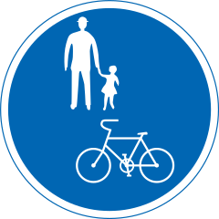
</td>
<td>
Bicycles_only
 
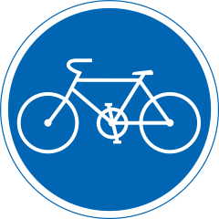
</td>
<td>
Bumpy_road
 
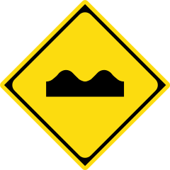
</td>
</tr>
<tr>
<td>
Buses_priority
 
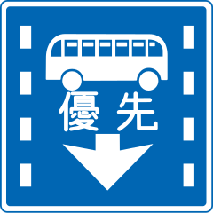
</td>
<td>
Center_line
 
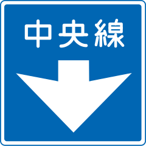
</td>
<td>
Closed_to_pedestrians
 
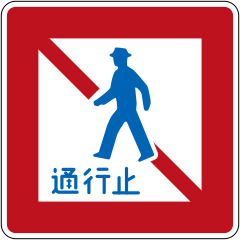
</td>
</tr>
<tr>
<td>
Crossroads
 
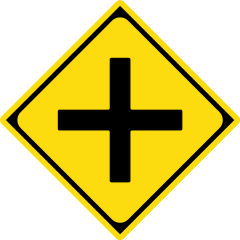
</td>
<td>
Dangerous_wind_gusts
 
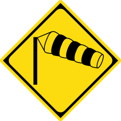
</td>
<td>
Directions_indicator
 
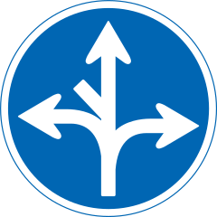
</td>
</tr>
<tr>
<td>
End_of_restriction
 

</td>
<td>
Falling_rocks
 
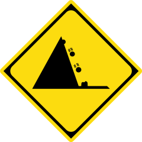
</td>
<td>
Go_straight
 
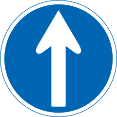
</td>
</tr>
<tr>
<td>
Keep_left
 
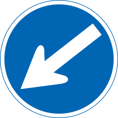
</td>
<td>
Keep_right
 
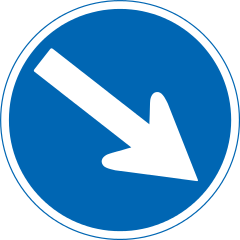
</td>
<td>
Left_curve
 
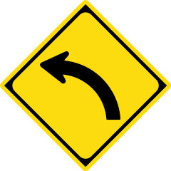
</td>
</tr>
<tr>
<td>
Left_lane_ends
 
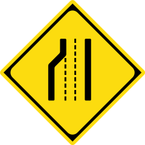
</td>
<td>
Left_turn
 
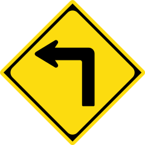
</td>
<td>
Maximum_speed_limit30km
 
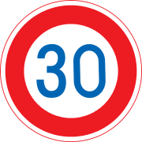
</td>
</tr>
<tr>
<td>
Maximum_speed_limit40km
 
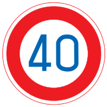
</td>
<td>
Maximum_speed_limit50km
 
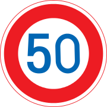
</td>
<td>
Maximum_speed_limit60km
 
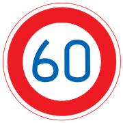
</td>
</tr>
<tr>
<td>
Maximum_speed_limit70km
 
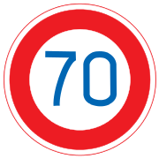
</td>
<td>
Maximum_speed_limit80km
 
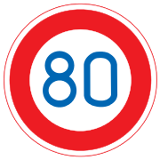
</td>
<td>
Maximum_speed_limit90km
 
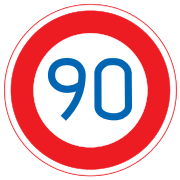
</td>
</tr>
<tr>
<td>
Merging_traffic_ahead
 
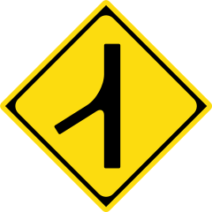
</td>
<td>
Minimum_speed_limit30km
 
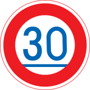
</td>
<td>
Minimum_speed_limit50km
 
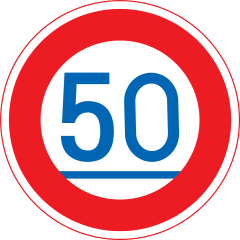
</td>
</tr>
<tr>
<td>
No_bicycles
 
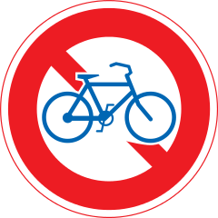
</td>
<td>
No_buses
 
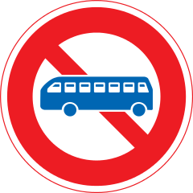
</td>
<td>
No_entry_for_vehicles
 
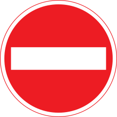
</td>
</tr>
<tr>
<td>
No_large_trucks
 
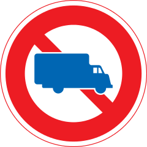
</td>
<td>
No_motorless_vehicle_except_bicycle
 
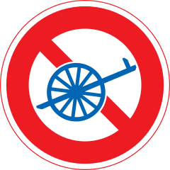
</td>
<td>
No_overtaking
 
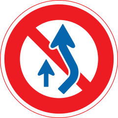
</td>
</tr>
<tr>
<td>
No_pedestrian_crossing
 
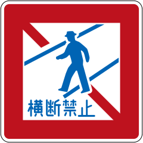
</td>
<td>
No_right_turn_crossing
 
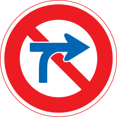
</td>
<td>
No_stopping
 
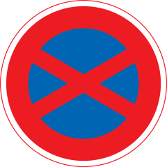
</td>
</tr>
<tr>
<td>
No_twoperson_motorcycles
 
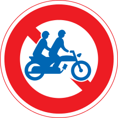
</td>
<td>
No_two_stage_right_turn_for_mopeds
 
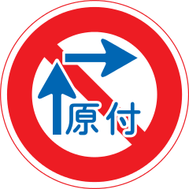
</td>
<td>
No_u_turns
 
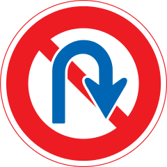
</td>
</tr>
<tr>
<td>
No_vehicles_carrying_dangerous_goods
 
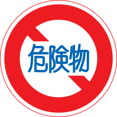
</td>
<td>
No_vehicles_except_motorcycles
 
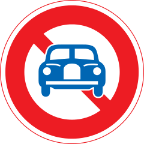
</td>
<td>
No_vehicles_higher_than3.3ms
 
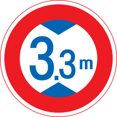
</td>
</tr>
<tr>
<td>
No_vehicles_weighing_over5.5ts
 
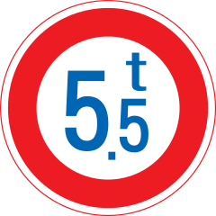
</td>
<td>
No_vehicles_wider_than2.2ms
 
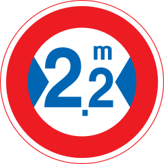
</td>
<td>
No_waiting
 
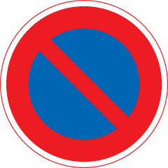
</td>
</tr>
<tr>
<td>
One_way
 
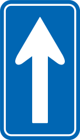
</td>
<td>
One_way_to_the_left
 
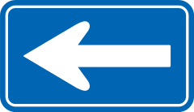
</td>
<td>
One_way_to_the_right
 
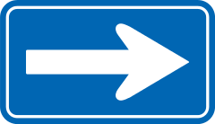
</td>
</tr>
<tr>
<td>
Other_dangers
 
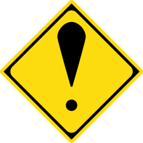
</td>
<td>
Parking_allowed
 
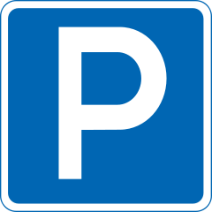
</td>
<td>
Pedesrtrian_crossing
 
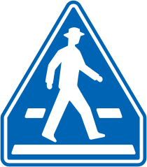
</td>
</tr>
<tr>
<td>
Pedestrians_only
 

</td>
<td>
Restricted_parking
 

</td>
<td>
Restricted_zone
 

</td>
</tr>
<tr>
<td>
Restriction_begins
 

</td>
<td>
Restriction_ends
 

</td>
<td>
Right_curve
 

</td>
</tr>
<tr>
<td>
Right_turn
 

</td>
<td>
Roadworks
 

</td>
<td>
Road_closed_to_all
 

</td>
</tr>
<tr>
<td>
Road_closed_to_vehicles
 

</td>
<td>
Road_narrows
 

</td>
<td>
Rotary
 

</td>
</tr>
<tr>
<td>
Roundabout
 

</td>
<td>
Safety_zone
 

</td>
<td>
School_crossing
 

</td>
</tr>
<tr>
<td>
School_zone
 

</td>
<td>
Series_of_curves_to_the_left
 

</td>
<td>
Series_of_curves_to_the_right
 

</td>
</tr>
<tr>
<td>
Slippery_road
 

</td>
<td>
Slow_down
 

</td>
<td>
Sound_horn
 

</td>
</tr>
<tr>
<td>
Steep_ascent10%
 

</td>
<td>
Steep_descent10%
 

</td>
<td>
Stop
 

</td>
</tr>
<tr>
<td>
Stopping_allowed
 

</td>
<td>
Stop_line
 

</td>
<td>
Straight_ahead_or_left_turn
 

</td>
</tr>
<tr>
<td>
Straight_ahead_or_right_turn
 

</td>
<td>
Traffic_light_ahead
 

</td>
<td>
Train_crossing
 

</td>
</tr>
<tr>
<td>
Turn_left
 

</td>
<td>
Turn_left_or_right
 

</td>
<td>
Turn_right
 

</td>
</tr>
<tr>
<td>
Two_stage_right_turn_for_mopeds
 

</td>
<td>
Two_way_traffic_ahead
 

</td>
<td>
T_junction
 

</td>
</tr>
<tr>
<td>
Vehicles_only
 

</td>
<td>
Wild_animals_crossing
 

</td>
<td>
Y_junction
 

</td>
</tr>
</table>

